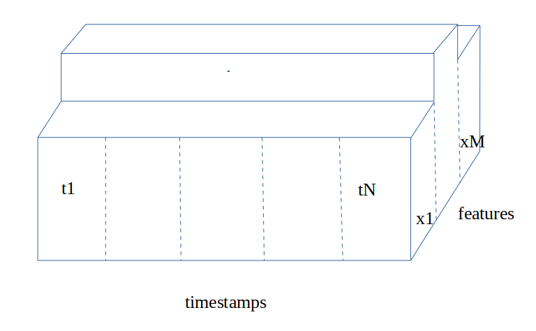
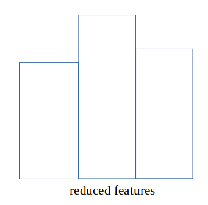

## Metric validation

### Motivation

There are different approaches for model validation. One can use k-fold or time-based validation. 
In the time-based approach, you use the most recent data to validate and older data to train
the model.  

Cons of this  time-based approach are that last data doesn't necessarily mean most similar for 
the test data.   

The metric validation is searching most similar validation set in the available data
based on some metric, calculated on input features.

**Pros**: you have more accurate validation. Pretty often in my practice predictions start to be
more precise.

**Cons**: to find validation closest to the test data you have to know input features for the
test data. In the real world, you probably don't know input features, because you haven't got them yet.
You will know them only at the moment of prediction.
If it is too many NaNs in the data, the metric validation starts to be useless

**Pros of cons**: for some tasks you do know test input features for the test.
For example, the capacity on some electricity markets is known before the electricity price.
Or the price of futures in the stock market.  
And some features have good approximations. Just because models and data for the input features
prediction are better than for the target. Or because input features less variable than the target.
For example, we use temperature to predict wholesale electricity prices. And temperature 
prediction for the short period is pretty good.

### Methodology

Let's consider some test data with M features and N timestamps. For the simplicity reasons
features are pictured with equal values for different timestamps. 

To make the comparison of features fair we first make scaling of the features.

To compute distance(euclidean or cosine) we have to reduce the timestamps dimension.
You can use simple mean, median, or you can make weighted averaging. 

And features you can use like it is, or you can stretch important features and shrink unimportant ones.
Weights could be obtained, for example, with feature importance in xgboost.

Here we have reduced features, which is just a point inside scaled and reduced feature space.
By applying similar transformation for the training data we map training data to a similar
space. And just search for the closest point. The set of the training data related to this point is our
validation candidate.

### Example

In this repo, I use the ovid-covid-data dataset. You can find it in
[here](https://github.com/owid/covid-19-data/tree/master/public/data/). Models are trained inside
one country's data. Label is `new_deaths_per_million`.
Predictions are made for 10 points of the future at each step.
In the best-case scenario, it will be 10 days but pretty often we have missed days.

In the real world, we can not use data from the future, such as `new_deaths_per_million` of
yesterday. But for the proof of concept, I consider it is ok.

Results compared between simple time validation and metric-based validation
